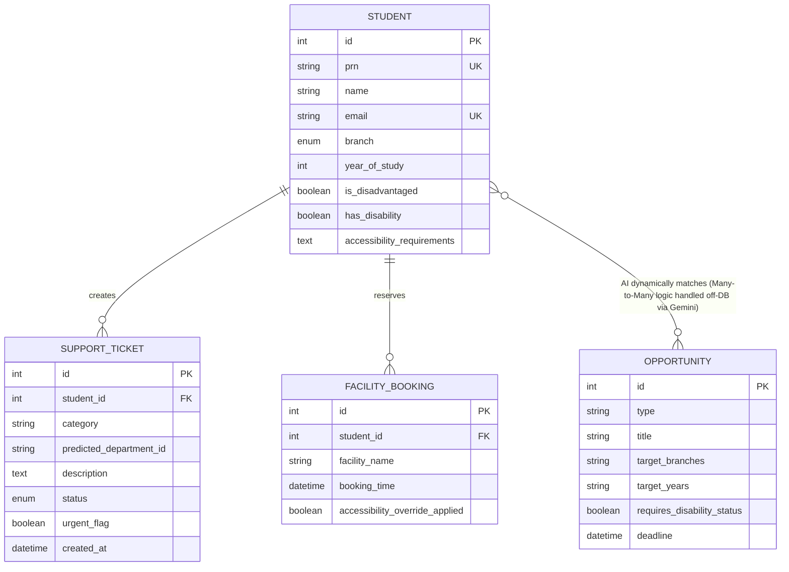

# Entity Relationship Model (Phase 4)

Below is the Entity Relationship Diagram (ERD) visualizing the precise PostgreSQL/SQLite architecture bridging the components written in `database_schema.py`.

