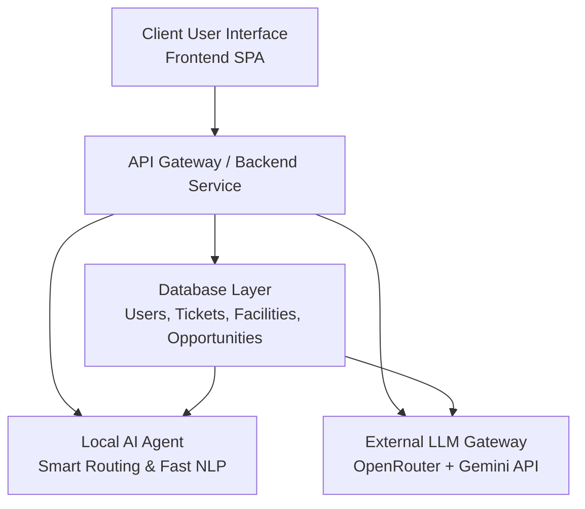

# Technical Architecture: PCCOE OneBridge

This document outlines the technical architecture of the **PCCOE OneBridge** platform. It expands on the conceptual implementation by defining the technical systems, the agentic AI layer, and how the various software modules will be built.

## 1. System Overview

The platform uses a hybrid AI architecture combined with a sleek, modern front-end. The core value of the platform is driven by two AI components working together: 
1. A **Local AI Agent** processing fast, privacy-focused tasks.
2. An **External LLM (Gemini via OpenRouter)** processing complex recommendation and analytical tasks via an API key.

---

## 2. Technology Stack

- **Frontend Core:** Pure HTML5, Vanilla CSS (Glassmorphism design), Vanilla JavaScript. It behaves like a Single Page Application (SPA).
- **Backend / API (Proposed):** Python (FastAPI) or Node.js (Express) to securely handle database connections and route API calls to the AI agents.
- **AI Integration:** 
  - **Local Agent:** A lightweight NLP model (like a local HuggingFace embedding model or Ollama standard instance) for instant data classification.
  - **Heavy Reasoning:** Gemini 1.5 Pro/Flash accessed via the OpenRouter API.

---

## 3. Dual-Agent AI Architecture

### 3.1 Local Agent
**Purpose:** Ensure student data privacy on minor tasks, route tickets efficiently, and answer basic technical FAQs without using cloud API tokens.

**Responsibilities:**
* **Smart Routing Mechanism (Module A):** Reads the description of a student's administrative/academic request and automatically assigns it to the exact administrative desk (e.g., Exam Section vs. Library vs. Faculty Mentor).
* **Conversational Helpdesk Chatbot (Module B):** Handles Level 1 queries (e.g., "Where is the maker space?", "How do I reset my LMS password?") by checking against local vector stores.
* **Early Intervention Text-Scoring (Module 9):** Flags toxic, urgent, or high-distress language locally so an immediate alert is escalated.

### 3.2 Gemini via OpenRouter API
**Purpose:** Handle deep reasoning, personalized advice, and highly unstructured matching using Google's Gemini models through an OpenRouter API key integration.

**Responsibilities:**
* **Scholarship Match Engine (Module C):** Cross-references a student's highly specific profile (income, grades, disability status) against hundreds of scholarship criteria.
* **Fellowship Readiness Score (Module D):** Analyses student's uploaded resumes and project descriptions, rating their readiness and offering feedback on SOPs using Gemini's generative capabilities.
* **Career Recommendation Engine (Module E):** Synthesizes branch, year, skills, and market trends to dynamically suggest internships and roles.

---

## 4. Platform Modules & Technical Mapping

The system is broken down into specific modular microservices or bounded contexts:

### Module A: Student Requirements Module
- **Frontend Component:** Ticket submission forms.
- **AI Role:** The **Local Agent** classifies the ticket text and predicts the `target_department_id`.
- **Backend Role:** Stores the ticket, alerts the department, records status changes.

### Module B: Support & Help Desk
- **Frontend Component:** Chatbot UI widget and deep-link mental health session booker.
- **AI Role:** The **Local Agent** attempts to resolve FAQs. If the student signals distress, it intelligently routes them directly to Personal/Wellbeing Support (EOC).

### Module C & D: Scholarships & Fellowships Hub
- **Frontend Component:** Filterable databases and profile match percentages.
- **AI Role:** The **Gemini API** is sent an anonymized payload of the student's academic profile. Gemini returns a JSON object containing the top 5 matches and a "Match Explanation" generated text.

### Module E: Internship & Job Opportunities
- **Frontend Component:** Year-wise Kanban boards or job feeds.
- **AI Role:** The **Gemini API** is triggered monthly or on-demand to process the user's latest added skills and match them against scraped/provided job listings.

### Module F: Facilities Access
- **Frontend Component:** Booking calendars and accessibility tags.
- **AI Role:** Minimal AI requirement. Relies heavily on robust traditional database scheduling logic. 

### Module G: EOC Integration Corner
- **Frontend Component:** Dedicated, highly accessible (screen-reader optimized, high contrast) sub-routing for EOC students.
- **AI Role:** Uses the **Local Agent** for completely private, secure interactions regarding grievance redressals without sensitive logs leaving the PCCOE internal server.

---

## 5. Security & API Management

Because we are using an external API via OpenRouter (Gemini), the API Keys **MUST** be protected.
1. The OpenRouter API key will be stored exclusively in a secure `.env` file on the backend server.
2. The Frontend (HTML/JS) will NEVER make direct calls to OpenRouter.
3. The Frontend calls the custom Backend API, which then appends the OpenRouter API key and handles the transaction, safely returning only the output to the client.

---

## 6. Development Phasing

- **Phase 1:** Build core frontend UI layouts (HTML/CSS/JS) for all modules.
- **Phase 2:** Initialize Python Backend. Setup the Local Agent for Smart Ticket Routing.
- **Phase 3:** Integrate OpenRouter (Gemini API) and build the Career/Scholarship Match Engine.
- **Phase 4:** EOC Accessibility compliance review and platform polish.
