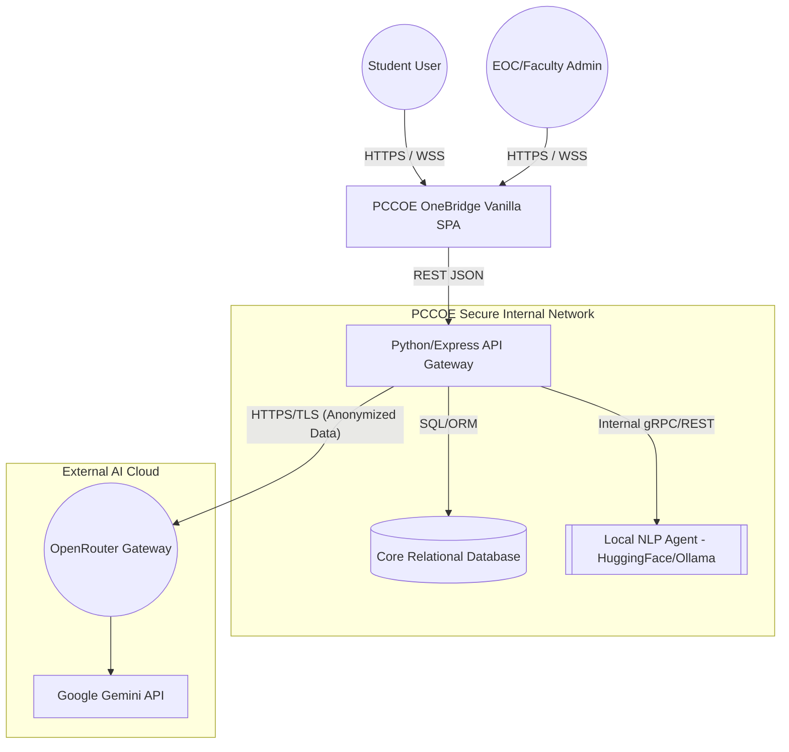
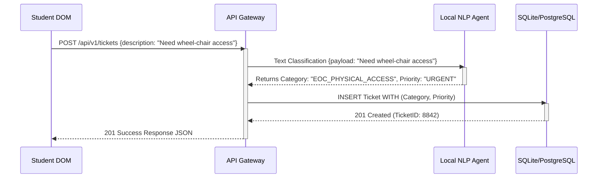
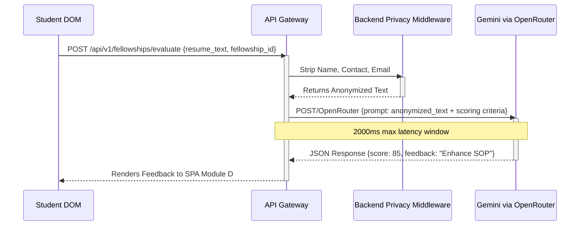

# Technical Architecture: PCCOE OneBridge (Phase 2 Update)

## 1. System Overview & Traffic Flow Blueprint

This document standardizes the exact Data Flow Diagrams (DFD) and Unified Modeling Language (UML) Sequence logic dictating how PCCOE OneBridge securely manages traffic between the DOM (Front-End), the core API gateway, the private internal resources, and the external LLM cloud networks.

### 1.1 High-Level Data Flow Diagram (DFD Level 0)

---

## 2. Security & Firewall Boundaries

To ensure strict compliance with the **WCAG & Privacy PRD bounds (Phase 1)**, the network relies on air-gapped mentalities for EOC transactions:
- **Rule 1:** The Frontend SPA NEVER possesses or has access to external API Keys.
- **Rule 2:** The API Gateway acts as a strict sanitizer. All JSON payloads are stripped of `StudentID` strings and replaced with Hash UUIDs before transmission to the External Cloud.
- **Rule 3:** Direct database queries bypass external layers entirely using the `LocalAI` for smart routing logic.

---

## 3. Detailed UML Sequence Diagrams

### 3.1 Smart Routing & Helpdesk Sequence (Using Local AI)
This handles basic student requirements and ticket escalation without touching cloud APIs, ensuring sub-200ms performance as dictated by the NFR rules.

### 3.2 Generative Resume/Fellowship Scorer (Using Gemini API)
This maps the complex processing of checking an applicant's resume against Fellowship parameters.

---

## 4. Accessibility Traffic
The frontend dynamically polls the backend to track accessibility issues (e.g. Broken Elevators).
If a facility manager flags a component, the database broadcasts an event. When a visually impaired user accesses the frontend SPA, the DOM automatically adjusts ARIA roles reading out real-time contingency blockers via the standard DOM API integrations.
